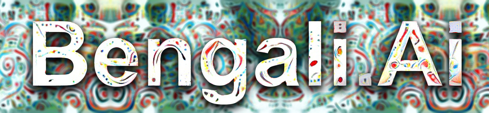
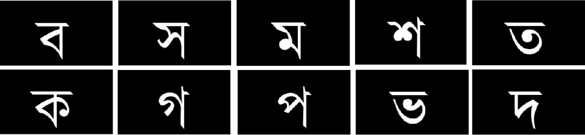

# Bengali.AI Handwritten Grapheme Classification

### Kaggle Competition 
In this repo, you can find the code I constructed for the Kaggle Bengali.AI competition.
The repo is work-in-progress, as the whole automated pipeline is not constructed (mostly Jupyter notebooks). 

## Notebooks
In the folder 'notebook', you can find the Jupyter notebooks, I collectively used to approach the problem from the beginning. 

Most of the raw datatset are not listed in github, as their file sizes are quite big (.parquet, .pkl). You can access the official dataset in the competition page

[Bengali.AI Handwritten Grapheme Classification](https://www.kaggle.com/c/bengaliai-cv19/data) 

The model consists of ResNet34 pre-trained (on Imagenet) model with a generalized mean pool and custom head layer. For augmentation, Albumentation is used.

The code should be able to run on any Python > 3.6 environment. Major packages used were:
- Pytorch 
- Numpy 
- Albumentation 
- Iterative-stratification

I've trained the model for 5 epochs for demonstration purposes (A code to save the model weights are included for your reference) 

You can consume the notebook files as the order presented in folder '/notebook'. It contains the following 6 files:
- 01_data_loading_and_sampling.ipynb
- 02_faster_loading_pickle.ipynb
- 03_Pytoch_dataset_creation_training_validation.ipynb
- 04_transfer_learning_CNN.ipynb
- 05_image_augmentation_1_albumentation.ipynb
- 06_Training_and_validation_pipeline.ipynb

To start training the model you need to use the training .parquet files to retreive images and following train.py file:

To run the training of the model, the Jupyter Notebook '06_Training_and_validation_pipeline.ipynb' can be used. Note that you do need to modify paths variables (always..)

## Kernel 
Reference: 
https://www.youtube.com/c/YouHanLee/videos
https://hoya012.github.io/blog/albumentation_tutorial/
